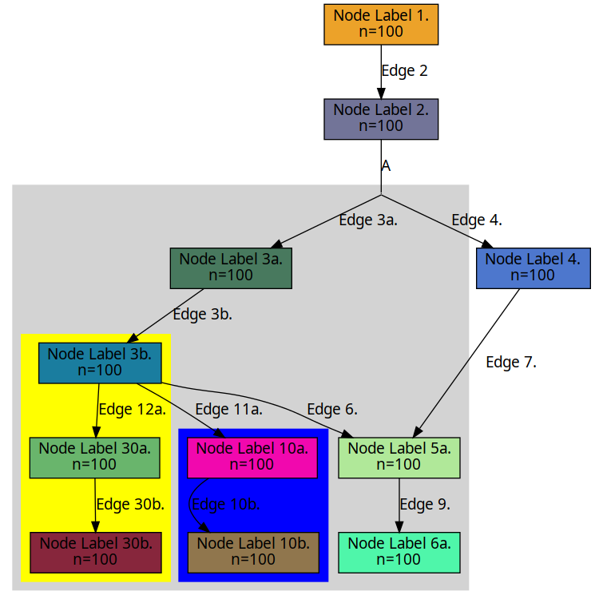

# Pydot Graph

A graph notation for creating Graphviz visualizations using Pydot.

## Example

### Instructions

```python
from pydot_graph import PydotGraph
import random
import pydot
from IPython.display import Image, display


def random_color():
    return "#" + hex(random.randint(0, 0xFFFFFF))[2:].rjust(6, "0")

# Construct the graph using a list of lists.

## Contruct a set of nodes that will have multiple references.
nodes = [
    pydot.Node(label=f"Node Label 5a.\nn={100}", fillcolor=random_color()),
    pydot.Edge(label="Edge 9."),
    pydot.Node(label=f"Node Label 6a.\nn={100}", fillcolor=random_color()),
]

## Construct the main graph.
pydot_graph = [
    pydot.Dot(graph_type="digraph", rankdir="TB"),
    pydot.Node(label=f"Node Label 1.\nn={100}", fillcolor=random_color()),
    pydot.Edge(label="Edge 2"),
    pydot.Node(label=f"Node Label 2.\nn={100}", fillcolor=random_color()),
    pydot.Edge(dir="none", label="A"),
    pydot.Node(shape="point", color="black", height=0, width=0),
    pydot.Edge(label="Edge 3a."),
    [
        pydot.Cluster(style="filled", color="lightgrey"),
        pydot.Node(label=f"Node Label 3a.\nn={100}", fillcolor=random_color()),
        pydot.Edge(label="Edge 3b."),
        pydot.Node(label=f"Node Label 3b.\nn={100}", fillcolor=random_color()),
        pydot.Edge(label="Edge 12a."),
        [
            pydot.Cluster(style="filled", color="yellow"),
            pydot.Node(label=f"Node Label 30a.\nn={100}", fillcolor=random_color()),
            pydot.Edge(label="Edge 30b."),
            pydot.Node(label=f"Node Label 30b.\nn={100}", fillcolor=random_color()),
        ],
        pydot.Edge(label="Edge 11a."),
        [
            pydot.Cluster(style="filled", color="blue"),
            pydot.Node(label=f"Node Label 10a.\nn={100}", fillcolor=random_color()),
            pydot.Edge(label="Edge 10b."),
            pydot.Node(label=f"Node Label 10b.\nn={100}", fillcolor=random_color()),
        ],
        pydot.Edge(label="Edge 6."),
        nodes,
    ],
    pydot.Edge(label="Edge 4."),
    pydot.Node(label=f"Node Label 4.\nn={100}", fillcolor=random_color()),
    pydot.Edge(label="Edge 7."),
    nodes,
]

# Create an instance of PydotGraph.
pydotGraph = PydotGraph(
    node_defaults={"shape": "box", "fontname": "Sans", "style": "filled", "fillcolor": "#eeeeee"},
    edge_defaults={"fontname": "Sans"},
)

# Build the graph.
graph = pydotGraph.build(pydot_graph)

# Write the graph to a file.
graph.write_png("output.png")

# Display the image.
Image(graph.create_png())
```

#### Output
